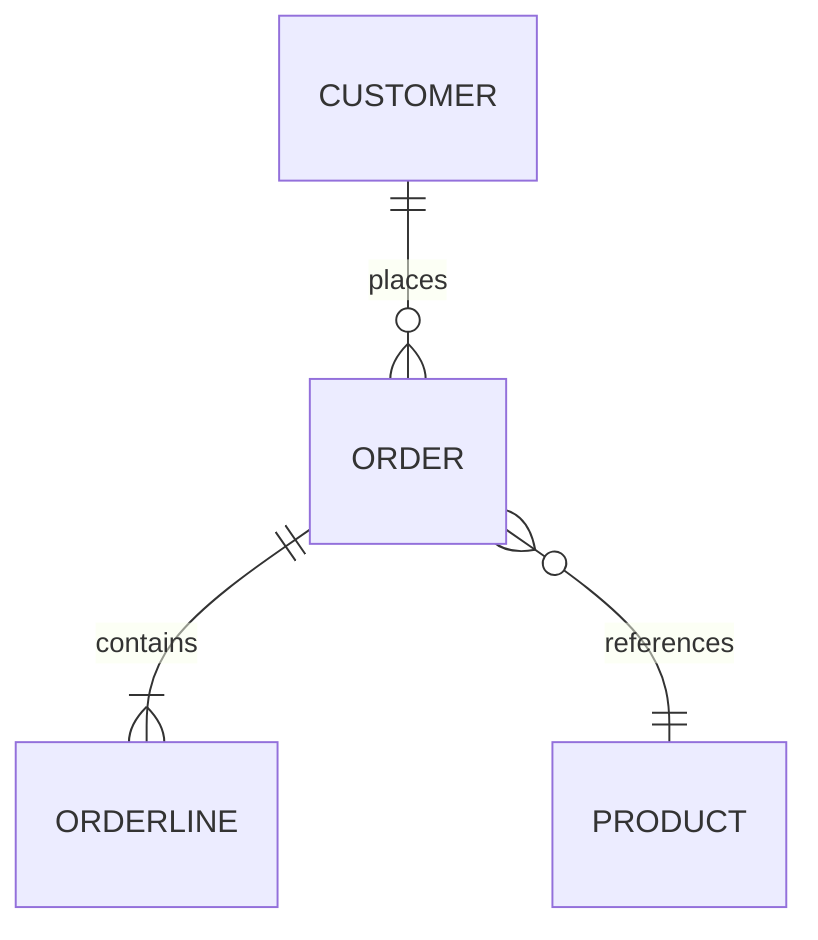

# Business Model / Ontology — <Customer Name>

> **Purpose.** This document is the *grounding artifact* for the AI-Driven Development lifecycle.
> Everything downstream — requirements, specs, data models, API contracts, tests, and generated
> code — must trace back to the Objects, Links, and Actions defined here. If a term does not
> appear in this document, it does not belong in a spec.
>
> **Two ways to fill this in.** Run the guided app — `apps/ontology-builder/index.html` — which
> walks through the same structure and writes this file for you, complete with a machine-readable
> appendix. Or work in this file directly, as below.
>
> **How to use it.** Fill in Part 1 (Context) and Part 2 (Glossary) first, then model the
> Objects (Part 3), the Links between them (Part 4), and the Actions taken on them (Part 5).
> Copy the "Object Template" block once per object. Delete guidance blockquotes before sharing.

| Field | Value |
|---|---|
| Customer | `<Legal / trading name>` |
| Business unit / domain in scope | `<e.g. Commercial Lending — Origination>` |
| Document owner (PM) | `<name, email>` |
| Customer SMEs consulted | `<name — role; name — role>` |
| Version | `v0.1` |
| Status | `Draft \| In Review \| Approved` |
| Last updated | `YYYY-MM-DD` |
| Approved by (customer) | `<name, role, date>` |

---

## Part 1 — Business Context

### 1.1 What the business does
> Two or three paragraphs in the customer's own language. No solution talk, no technology.

`<...>`

### 1.2 Scope of this ontology

| In scope | Out of scope (and why) |
|---|---|
| `<process / capability>` | `<process / capability — reason>` |

### 1.3 Business outcomes this engagement must move

| # | Outcome | Current measure | Target | Owner |
|---|---|---|---|---|
| O1 | `<e.g. reduce quote turnaround>` | `<4 days>` | `<4 hours>` | `<name>` |

### 1.4 Source material
> Where this model came from — so a reviewer can audit any claim.

| Source | Type | Date | Notes |
|---|---|---|---|
| `<Workshop with Ops team>` | Interview | `YYYY-MM-DD` | `<...>` |
| `<Legacy schema export>` | System artifact | `YYYY-MM-DD` | `<...>` |

---

## Part 2 — Glossary & Naming Conventions

### 2.1 Ubiquitous language
> One row per term the business uses. Capture synonyms explicitly — ambiguity here becomes
> defects downstream.

| Term | Definition | Synonyms / aliases in use | Do NOT confuse with |
|---|---|---|---|
| `<Policy>` | `<...>` | `<contract, cover note>` | `<Quote>` |

### 2.2 Conventions used in this document

- **Objects** are singular `PascalCase` nouns (`PurchaseOrder`, not `purchase_orders`).
- **Links** are verb phrases read source → target (`Customer *places* Order`).
- **Actions** are imperative verbs (`ApproveInvoice`, not `InvoiceApproval`).
- IDs: Objects `OBJ-nn`, Links `LNK-nn`, Actions `ACT-nn`, Rules `RULE-nn`, Events `EVT-nn`.
- `<Your additions>`

---

## Part 3 — Objects

> An **Object** is a thing the business recognises, talks about, and keeps track of over time.
> Test: can someone point at an instance and say "this one"? If yes, it is an Object.
> If it only describes another thing, it is a *property*. If it only happens, it is an *Action*
> or *Event*.

### 3.1 Object index

| ID | Object | One-line description | Type | Owner (business) | System of record | Est. volume | Status |
|---|---|---|---|---|---|---|---|
| OBJ-01 | `<Customer>` | `<...>` | Core | `<Sales Ops>` | `<Salesforce>` | `<12k>` | Approved |
| OBJ-02 | `<Order>` | `<...>` | Core | `<...>` | `<...>` | `<...>` | Draft |
| OBJ-03 | `<...>` | `<...>` | Supporting / Reference | `<...>` | `<...>` | `<...>` | Draft |

*Type:* `Core` (the business exists to manage it) · `Supporting` (enables core work) ·
`Reference` (lookup / classification data) · `External` (mastered outside the customer).

---

### 3.2 Object Template
> **Copy this whole block once per object.** Keep the headings identical — downstream tooling
> and AI agents parse them.

#### OBJ-nn · `<ObjectName>`

**Description**
> Plain-English, 2–5 sentences. What is it, why does the business care, when does an instance
> come into existence, and when does it stop mattering? Written so a new joiner understands it
> without asking a follow-up question.

`<...>`

**At a glance**

| Attribute | Value |
|---|---|
| Also known as | `<synonyms>` |
| Type | `Core \| Supporting \| Reference \| External` |
| Business owner | `<role / team>` |
| System of record | `<system>` |
| Unique identifier | `<e.g. Order Number — human-readable, customer-facing>` |
| Typical volume / growth | `<50k records, +2k per month>` |
| Retention / regulatory | `<7 years, FCA>` |
| Data sensitivity | `Public \| Internal \| Confidential \| PII \| PCI \| PHI` |

**Properties**
> The facts recorded about each instance. Add rows freely — this table is meant to grow.
> Keep *business* properties here; leave storage types and column names to the data spec.
> Use `Derived` for anything calculated, and state the calculation.

| Property | Description | Example value | Type | Required? | Derived? (formula) | Source | Notes / constraints |
|---|---|---|---|---|---|---|---|
| `<orderNumber>` | `<Customer-facing reference>` | `<ORD-10023>` | Identifier | Yes | No | `<ERP>` | `<Immutable once issued>` |
| `<placedAt>` | `<When the customer committed>` | `<2026-03-04T09:12Z>` | Date/time | Yes | No | `<Web checkout>` | `<UTC>` |
| `<totalValue>` | `<Sum of line items ex-VAT>` | `<1,420.00 GBP>` | Money | Yes | Yes — `SUM(lineItem.value)` | `<Derived>` | `<Currency per order>` |
| `<status>` | `<Where it is in the lifecycle>` | `<Awaiting payment>` | Enumeration | Yes | No | `<ERP>` | `<See States below>` |
| `<...>` | `<...>` | `<...>` | `Text \| Number \| Money \| Date \| Boolean \| Enumeration \| Reference \| Document` | `<Yes/No>` | `<...>` | `<...>` | `<...>` |

**Custom / customer-specific properties**
> Anything that does not fit the columns above — regulatory flags, legacy fields kept for
> migration, properties that exist only for one region or product line. Free-form on purpose:
> add a row, or a short sub-heading with prose if a property needs real explanation.

| Property | Description | Why it exists / who asked for it | Applies when |
|---|---|---|---|
| `<...>` | `<...>` | `<...>` | `<e.g. UK entity only>` |

**States (lifecycle)**
> Only for objects that move through a lifecycle. Delete otherwise.

| State | Meaning | Entered by (Action) | Exits to |
|---|---|---|---|
| `<Draft>` | `<...>` | `<ACT-01 CreateOrder>` | `<Submitted, Cancelled>` |
| `<Submitted>` | `<...>` | `<ACT-02 SubmitOrder>` | `<Approved, Rejected>` |

**Business rules & invariants**
> Statements that must always hold. These become acceptance criteria and tests.

| ID | Rule | Enforced when | Consequence if violated |
|---|---|---|---|
| RULE-01 | `<An Order cannot be submitted without at least one line item.>` | `<On submit>` | `<Reject with message>` |

**Key questions / open issues**

| # | Question | Raised by | Needs answer from | By when | Status |
|---|---|---|---|---|---|
| 1 | `<Do partial shipments create new Orders?>` | `<PM>` | `<Ops lead>` | `YYYY-MM-DD` | Open |

**Examples**
> One or two real (anonymised) instances. Concrete examples catch modelling errors that
> abstract definitions hide — and they make excellent test fixtures.

```yaml
orderNumber: ORD-10023
placedAt: 2026-03-04T09:12Z
totalValue: 1420.00 GBP
status: Awaiting payment
placedBy: CUST-88121   # Link LNK-01 → Customer
```

<!-- END OBJECT TEMPLATE — copy from "#### OBJ-nn" down to here -->

---

## Part 4 — Links Between Objects

> A **Link** is a meaningful, named relationship the business relies on. Name it as a verb phrase
> that reads naturally in both directions, and record *why it matters* — a link with no business
> consequence is usually an implementation detail, not ontology.

### 4.1 Link index

| ID | Source object | Link (source → target) | Target object | Cardinality | Reverse reading | Required? | Lifecycle rule | Why it matters |
|---|---|---|---|---|---|---|---|---|
| LNK-01 | `Customer` | `places` | `Order` | 1 → 0..* | `Order is placed by Customer` | Yes | `<Order cannot exist without Customer>` | `<Drives billing & entitlement>` |
| LNK-02 | `Order` | `contains` | `OrderLine` | 1 → 1..* | `OrderLine belongs to Order` | Yes | `<Cascade delete>` | `<...>` |
| LNK-03 | `<...>` | `<...>` | `<...>` | `<0..1 → 0..*>` | `<...>` | `<No>` | `<...>` | `<...>` |

*Cardinality notation:* `1`, `0..1`, `1..*`, `0..*` — read as *source instances → target instances*.

### 4.2 Link detail
> Only for links carrying their own properties, or with non-obvious rules. Copy per link.

#### LNK-nn · `<Source> <verb> <Target>`

**Description** — `<...>`

| Attribute | Value |
|---|---|
| Cardinality | `<1 → 0..*>` |
| Optional / mandatory | `<...>` |
| Can it change over time? | `<e.g. an Order can be reassigned to another Account>` |
| What happens on delete/archive of source | `<...>` |

**Link properties** (facts about the relationship itself, not either object)

| Property | Description | Example | Notes |
|---|---|---|---|
| `<assignedAt>` | `<When ownership transferred>` | `<2026-03-05>` | `<...>` |

### 4.3 Relationship map
> Optional but strongly recommended. Keep it in sync with 4.1.



---

## Part 5 — Actions

> An **Action** is something a person, system, or rule *does to* an object — the verbs of the
> business. Each Action is the seed of a use case, an API operation, and a set of tests.

### 5.1 Action index

| ID | Action | Primary object | Actor / role | Trigger | Pre-conditions | Post-conditions (state change) | Frequency | Criticality |
|---|---|---|---|---|---|---|---|---|
| ACT-01 | `CreateOrder` | `Order` | `<Sales Rep>` | `<Customer request>` | `<Customer is active>` | `<Order in Draft>` | `<200/day>` | High |
| ACT-02 | `ApproveOrder` | `Order` | `<Sales Manager>` | `<Submission>` | `<Value > £10k>` | `<Order Approved; EVT-02 raised>` | `<40/day>` | High |
| ACT-03 | `<...>` | `<...>` | `<...>` | `<Scheduled \| Manual \| System \| External>` | `<...>` | `<...>` | `<...>` | `<Low>` |

### 5.2 Action detail
> Copy per significant Action. Skip for trivial CRUD that the index already covers.

#### ACT-nn · `<ActionName>`

**Description** — `<What it achieves in business terms, and why it exists.>`

| Attribute | Value |
|---|---|
| Objects read | `<Customer, PriceList>` |
| Objects created / modified | `<Order (Draft → Submitted)>` |
| Links created / broken | `<LNK-01 Customer places Order>` |
| Actor(s) & authority | `<Sales Manager; approval limit £50k>` |
| Trigger | `<Manual \| Scheduled \| Event EVT-nn \| External system>` |
| Reversible? | `<Yes — via ACT-09 CancelOrder>` |
| SLA / timing | `<Within 4 business hours>` |
| Audit requirement | `<Who, when, previous value — 7 year retention>` |

**Steps**
1. `<...>`
2. `<...>`

**Rules applied** — `<RULE-01, RULE-04>`

**Failure / exception paths**

| Condition | Business handling |
|---|---|
| `<Credit check fails>` | `<Route to Credit team; Order stays Submitted>` |

**Acceptance criteria (draft)**
- Given `<...>` when `<...>` then `<...>`

### 5.3 Events
> Notable things the business reacts to. Useful when Actions in one area trigger work in another.

| ID | Event | Raised by | Carries | Consumed by |
|---|---|---|---|---|
| EVT-01 | `OrderApproved` | `ACT-02` | `<Order ID, approver, timestamp>` | `<Fulfilment, Billing>` |

---

## Part 6 — Actors, Roles & Permissions

| Role | Description | Objects they see | Actions they may perform | Constraints |
|---|---|---|---|---|
| `<Sales Rep>` | `<...>` | `<Own Customers, Orders>` | `<ACT-01, ACT-04>` | `<Own region only>` |
| `<Billing System>` | `<Non-human actor>` | `<Invoice>` | `<ACT-07>` | `<Nightly window>` |

---

## Part 7 — Systems & Data Landscape

| System | Role | Objects mastered | Objects consumed | Integration style | Notes |
|---|---|---|---|---|---|
| `<Salesforce>` | CRM | `<Customer>` | `<Order>` | `<REST API>` | `<...>` |

---

## Part 8 — Coverage & Traceability

### 8.1 Outcome → ontology coverage
> Every business outcome in 1.3 should be reachable through Objects and Actions defined here.

| Outcome | Objects involved | Actions involved | Gap? |
|---|---|---|---|
| O1 | `<Order, Quote>` | `<ACT-01, ACT-02>` | `<None>` |

### 8.2 Downstream traceability
> Filled in as the lifecycle progresses. Keeps specs and code anchored to this model.

| Ontology ID | Requirement / Epic | Spec | Component / Module | Tests |
|---|---|---|---|---|
| OBJ-02 | `<REQ-14>` | `<SPEC-Order>` | `<order-service>` | `<...>` |

---

## Part 9 — Review & Sign-off

### 9.1 Validation checklist
- [ ] Every Object has a description, an owner, and a system of record.
- [ ] Every Object has a unique identifier property.
- [ ] Every term used in an Object or Action description appears in the Glossary (2.1).
- [ ] Every Link has a cardinality and reads naturally in both directions.
- [ ] Every Object is reachable via at least one Link, or is deliberately standalone.
- [ ] Every Action names its actor, trigger, and post-conditions.
- [ ] Every Object with a lifecycle has states, and each state is entered by a named Action.
- [ ] At least one concrete example exists per Core object.
- [ ] Every business outcome in 1.3 is covered in 8.1.
- [ ] All open questions are assigned an owner and a due date.
- [ ] A customer SME has read this document aloud and agreed with the wording.

### 9.2 Open questions (consolidated)

| # | Question | Owner | Due | Impact if unresolved | Status |
|---|---|---|---|---|---|
| 1 | `<...>` | `<...>` | `YYYY-MM-DD` | `<Blocks OBJ-04>` | Open |

### 9.3 Change log

| Version | Date | Author | Change | Customer re-approval needed? |
|---|---|---|---|---|
| v0.1 | `YYYY-MM-DD` | `<PM>` | Initial draft | — |

### 9.4 Sign-off

| Name | Role | Organisation | Date | Signature / approval reference |
|---|---|---|---|---|
| `<...>` | `<Business sponsor>` | `<Customer>` | `YYYY-MM-DD` | `<...>` |
| `<...>` | `<Delivery lead>` | `<Us>` | `YYYY-MM-DD` | `<...>` |
