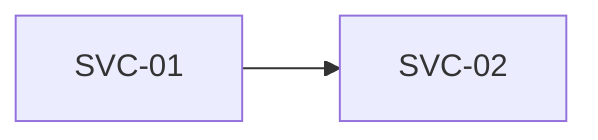

# Service Catalog — <Customer Name>

> **Purpose.** This document lists the services the IT solution must provide to the business.
> It sits between the Business Model / Ontology and delivery: every service is **grounded** in the
> ontology (the sub-domains that use it, the Objects it manages, the Actions it implements) and
> **traced** to the technical specs and work items that build it. Specs, stories, tests and code
> for a service must reference its `SVC-nn` ID.
>
> **Two ways to fill this in.** Use the Service Catalog module of the guided app —
> `apps/ontology-builder/index.html` → **Service Catalog** — which picks sub-domains, Objects and
> Actions straight from your Business Model and writes this file with a machine-readable appendix.
> Or work in this file directly, as below.
>
> **Before you start.** Finish the Business Model first (at least its sub-domains, Objects and
> Actions). This catalog references them by ID; it does not redefine them.
>
> **How to use it.** Fill in the header and 1.1, then copy the "Service Template" block (Part 2)
> once per service. Fill Delivery as specs and work items are created. Delete guidance
> blockquotes before sharing.

| Field | Value |
|---|---|
| Customer | `<Legal / trading name>` |
| Business unit / domain in scope | `<e.g. Center for Program Integrity (CPI)>` |
| Catalog owner | `<name, email>` |
| Grounded in ontology | `Business Model / Ontology — <Customer> · <domain> · <version>` |
| Version | `v0.1` |
| Status | `Draft \| In Review \| Approved` |
| Last updated | `YYYY-MM-DD` |
| Approved by (customer) | `<name, role, date>` |

---

## Part 1 — Catalog Overview

### 1.1 Purpose & scope
> Which release or programme this catalog covers, and what it deliberately leaves out.

`<...>`

### 1.2 Service index

| ID | Service | Category | Type | Sub-domain(s) | Status | Priority | Business owner |
|---|---|---|---|---|---|---|---|
| SVC-01 | `<Payment Sample Selection>` | Application | Batch / scheduled | `<PERM>` | Proposed | Must | `<team>` |
| SVC-02 | `<State Data Intake>` | Integration | Integration / interface | `<PERM, MEQC, BEA>` | In build | Must | `<team>` |

*Category:* Business · Application · Data · Integration · Reporting & analytics · Platform · Security & identity
*Type:* User-facing (UI) · API · Batch / scheduled · Event-driven · Report / dashboard · Integration / interface · Workflow
*Status:* Proposed → Approved → In design → In build → Live → Retired
*Priority:* Must · Should · Could · Won't (this release)

### 1.3 Sub-domain coverage
> Which sub-domains use which services. A sub-domain column with no marks is either out of scope
> for this release or a gap to raise with its SMEs. Services used by several sub-domains are
> shared — their contracts need sign-off from every sub-domain that uses them.

| Service | `<PERM>` | `<MEQC>` | `<BEA>` |
|---|---|---|---|
| SVC-01 `<name>` | ● |  |  |
| SVC-02 `<name>` | ● | ● | ● |
| **Services** | **2** | **1** | **1** |

### 1.4 Ontology coverage
> One row per Action in the Business Model. An Action no service implements is a requirement
> nobody is building yet.

| Action | Primary object | Implemented by |
|---|---|---|
| `ACT-01 <ActionName>` | `<Object>` | `SVC-01` |
| `ACT-02 <ActionName>` | `<Object>` | **none** |

---

## Part 2 — Services

### 2.1 Service Template
> **Copy this whole block once per service.** Keep the headings identical — downstream tooling
> and AI agents parse them.

### SVC-nn · `<ServiceName>`

**Sub-domains:** `<CODE>` · `<CODE>`
> Every sub-domain whose people or processes will use this service. Codes from the Business Model.

**Summary** — `<One sentence: what the service does for the business.>`

**At a glance**

| Attribute | Value |
|---|---|
| Category | `<Application>` |
| Type | `<User-facing (UI)>` |
| Status | `<Proposed>` |
| Priority | `<Must>` |
| Business owner | `<role / team>` |
| Technical owner | `<role / team>` |
| Consumers (roles / systems) | `<who or what calls it>` |
| Data sensitivity | `Public \| Internal \| Confidential \| PII \| PCI \| PHI` |

**Description**
> Optional. When it runs, who relies on it, anything a builder needs that the summary can't carry.

`<...>`

**Grounding in the ontology**
> The Objects this service manages or exposes and the Actions it implements, by ID. This is what
> keeps generated specs and code tied to the business model. Every service needs at least one.

| Kind | Reference |
|---|---|
| Object | `OBJ-nn <ObjectName>` |
| Action | `ACT-nn <ActionName>` |

**Operations**
> What callers can ask the service to do. Each becomes an endpoint, screen action or job — and a
> set of tests. Link the Action it implements and the Object it acts on where there is one.

| Operation | Description | Implements action | On object | Access | Inputs | Outputs |
|---|---|---|---|---|---|---|
| `<RecordFinding>` | `<...>` | `<ACT-02>` | `<OBJ-04>` | `Read \| Create \| Update \| Delete \| Create / update` | `<...>` | `<...>` |

**Service levels**
> Targets the service must meet. Must-priority services need at least availability or response time.

| Measure | Target |
|---|---|
| Availability | `<99.5% business hours>` |
| Response time | `<< 2 s>` |
| Throughput / volume | `<...>` |
| Support hours | `<...>` |
| Recovery (RPO / RTO) | `<...>` |

**Dependencies**

- Services: `<SVC-nn Name>` — other services this one needs; they get built first.
- External systems: `<systems outside this solution it calls or receives from>`

**Security & compliance** — `<access rules, audit, retention, regulatory constraints>`

**Acceptance criteria**
> One per line, Given / When / Then. These seed the test specs.

- Given `<...>` when `<...>` then `<...>`

**Delivery — technical specs**

| Spec | Title | Status |
|---|---|---|
| `<SPEC-INT-01>` | `<[Title](link)>` | `Draft \| In review \| Approved \| Superseded` |

**Delivery — work items**
> Keys from your tracker. Services In build or Live need at least one spec and one work item.

| Key | Type | Title | Status |
|---|---|---|---|
| `<CPI-214>` | `Epic \| Feature \| Story \| Task \| Spike \| Bug` | `<[Title](link)>` | `Backlog \| To do \| In progress \| In review \| Done \| Blocked` |

**Open questions**

| Question | Owner | Due | Status |
|---|---|---|---|
| `<...>` | `<...>` | `YYYY-MM-DD` | Open |

<!-- END SERVICE TEMPLATE — copy from "### SVC-nn" down to here -->

---

## Part 3 — Service Dependencies
> Arrows point from a service to the services it depends on. Keep it free of cycles.

---

## Part 4 — Delivery Traceability
> One row per service: where it comes from and what delivers it.

| Service | Sub-domain(s) | Ontology refs | Tech specs | Work items | Status |
|---|---|---|---|---|---|
| SVC-01 `<name>` | `<PERM>` | `<OBJ-02, ACT-01>` | `<SPEC-PERM-01>` | `<CPI-101>` | `<In design>` |

---

## Part 5 — Review

### 5.1 Validation checklist
- [ ] Customer, domain and catalog owner recorded.
- [ ] The catalog names the Business Model version it is grounded in.
- [ ] Service IDs are unique, and every service has a name, summary and business owner.
- [ ] Every service is used by at least one sub-domain, and every sub-domain uses at least one service.
- [ ] Every service references at least one ontology Object or Action, and every reference exists.
- [ ] Every Action in the Business Model is implemented or supported by a service.
- [ ] Every service lists at least one operation and has acceptance criteria.
- [ ] Every Must service has an availability or response-time target.
- [ ] Service dependencies refer to other defined services and contain no cycles.
- [ ] Services In build or Live have a tech spec and work items.
- [ ] All open questions have an owner and a due date.
- [ ] Shared services (used by several sub-domains) have been reviewed with each sub-domain's SMEs.

### 5.2 Open questions (consolidated)

| Question | Owner | Due | Impact if unresolved | Status |
|---|---|---|---|---|
| `<...>` | `<...>` | `YYYY-MM-DD` | `<Blocks SVC-03>` | Open |

### 5.3 Change log

| Version | Date | Author | Change |
|---|---|---|---|
| v0.1 | `YYYY-MM-DD` | `<PM>` | Initial draft |
